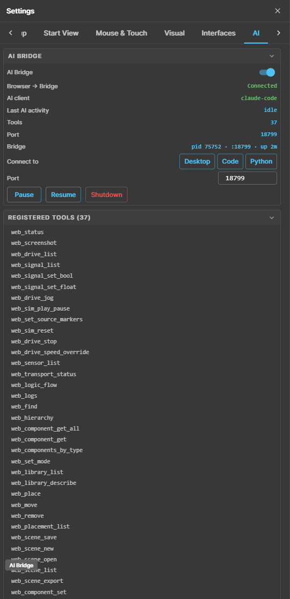
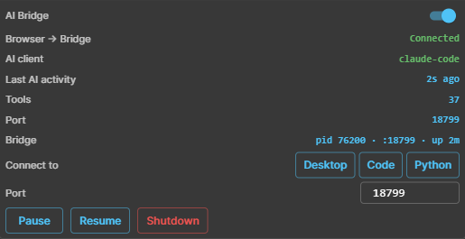
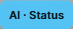
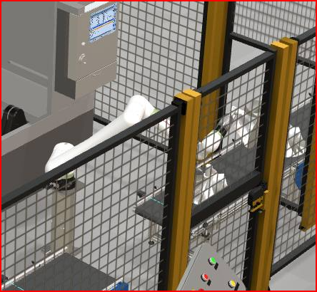

# AI Integration & the MCP Bridge

realvirtual WEB exposes its running 3D scene to AI assistants (Claude Code, Claude
Desktop) through a local **MCP bridge**. Once connected, the assistant can inspect
and control the live browser scene — read drives, signals, sensors and transport
state, drive the simulation, capture screenshots, and build layouts in the Layout
Planner — using a set of `web_*` tools.

This document covers the architecture, setup, the in-app **AI Bridge** status panel,
the AI activity indicator, the `web_screenshot` cropping options, and troubleshooting.
For the exhaustive per-tool reference see [`webviewer.mcp.md`](webviewer.mcp.md).

## Architecture

The connection is a three-link chain:

```
   Claude (MCP host)                 Node bridge                     Browser (realvirtual WEB)
 ┌───────────────────┐   stdio    ┌──────────────────────┐  WebSocket  ┌──────────────────────┐
 │ Claude Code /      │  (MCP) ⟷  │ mcp-bridge/dist/      │   :<port>   │ McpBridgePlugin       │
 │ Claude Desktop     │           │ index.js              │   /webviewer│  → RVViewer scene     │
 └───────────────────┘           └──────────────────────┘  ⟷ browser  └──────────────────────┘
        host                       stdio MCP server +                    web_* tools live here
                                   WebSocket server
```

- **Claude** launches the **Node bridge** as a stdio child process (from `.mcp.json` /
  the Claude Desktop config). It speaks MCP (JSON-RPC) over stdin/stdout.
- The **bridge** also hosts a WebSocket server. The **browser** connects to it as a
  client at `ws://localhost:<port>/webviewer`.
- The browser **owns the tools**: on connect it sends a `discover` message with the
  `web_*` tool schemas (generated from `@McpTool` decorators in
  `src/plugins/mcp-bridge-plugin.ts`) plus the `webviewer.mcp.md` instructions. The
  bridge registers them as MCP tools and forwards every tool call to the browser.

Because the browser defines the tools, the bridge needs no tool knowledge — it is a
generic relay. A tool added to `McpBridgePlugin` appears automatically after a reconnect.

### Ports

Each AI client drives its own bridge on its own port, so several can coexist:

| Port  | Bridge                          | Driven by        |
|-------|---------------------------------|------------------|
| 18714 | Node bridge                     | Claude Desktop   |
| 18715 | Node bridge                     | Claude Code      |
| 18712 | Python bridge (Unity MCP server)| Unity Editor MCP |

The browser connects to **exactly one** port at a time — that decides which assistant
drives it. Switch it in the AI Bridge panel (see below).

## Setup

1. **Build the bridge** (one-time, and after bridge code changes):

   ```bash
   cd Assets/realvirtual-WebViewer~/mcp-bridge
   npm run setup        # = npm install && npm run build  (or double-click setup.cmd)
   ```

   `dist/` is git-ignored, so it must be built before first use.

2. **Register the bridge with Claude.** Easiest in Unity:
   *Tools ▸ realvirtual ▸ Settings ▸ Configure Claude Desktop MCP*. Or add it to your
   `.mcp.json` (Claude Code) / `claude_desktop_config.json` (Claude Desktop):

   ```json
   "WebViewerMCP": {
     "command": "node",
     "args": [
       "<project>/Assets/realvirtual-WebViewer~/mcp-bridge/dist/index.js",
       "--web-port", "18715"
     ]
   }
   ```

3. **Restart Claude** so it launches the bridge, then enable **AI Bridge** in the
   WebViewer (toggle in the panel) and pick the matching port.

## The AI Bridge panel

Open it from the **AI Bridge** button in the activity bar, or *Settings ▸ AI*. The
status section shows the **full chain** — not just the WebSocket link, but whether a
live AI client is actually attached and what it is doing.



### Status rows



| Row | Meaning |
|-----|---------|
| **Browser → Bridge** | The browser↔bridge WebSocket link: *Connected*, *Reconnecting*, *Disconnected* or *Disabled*. |
| **AI client** | The MCP host attached to the bridge, e.g. `claude-code`. This is the real proof an assistant is connected — a connected WebSocket alone does not mean a live AI is present. |
| **Last AI activity** | Time since the assistant's last request (a tool call or tool list), e.g. *just now* / *2s ago*. *idle* when nothing has happened yet. |
| **Tools** | Number of `web_*` tools registered from the browser. |
| **Port** | The port the browser is connected to. |
| **Bridge** | Bridge process identity: `pid · :port · uptime`. Disambiguates duplicate bridges and shows how long it has been running. |

### Controls

- **Connect to** — one-click switch between **Desktop** (18714), **Code** (18715) and
  **Python** (18712). The **Port** field sets any custom port.
- **Pause / Resume** — stop or resume accepting browser connections.
- **Shutdown** — ask the bridge process to exit (it can only be relaunched by the AI
  host, not from the browser).
- **Registered Tools** — the live list of `web_*` tools the assistant can call.
- **Server Log** — log lines streamed from the bridge (bind, connect, discover, …).

## AI activity indicator

While the assistant performs an action, a pill in the **accent color** appears next to
the AI Bridge button (over the 3D scene) showing the current operation, e.g.
`AI · Drive list`. It auto-clears a few seconds after the last action. The AI Bridge
button icon also turns the accent color while the assistant is working.



The accent color follows the theme, so custom branding recolors it automatically.

## Tools overview

The `web_*` tools fall into four groups (full reference in
[`webviewer.mcp.md`](webviewer.mcp.md)):

- **Inspect** — `web_status`, `web_drive_list`, `web_signal_list`, `web_sensor_list`,
  `web_transport_status`, `web_logic_flow`, `web_find`, `web_hierarchy`,
  `web_component_get`, `web_component_get_all`, `web_components_by_type`, `web_logs`.
- **Control** — `web_signal_set_bool`, `web_signal_set_float`, `web_drive_jog`,
  `web_drive_stop`, `web_drive_speed_override`, `web_sim_play_pause`, `web_sim_reset`,
  `web_set_source_markers`.
- **Screenshot** — `web_screenshot` (see below).
- **Authoring** (Layout Planner) — `web_set_mode`, `web_library_list`,
  `web_library_describe`, `web_place`, `web_move`, `web_remove`, `web_placement_list`,
  `web_snap_list`, `web_snap_suggest`, `web_snap_attach`, `web_component_set`,
  `web_scene_new`, `web_scene_save`, `web_scene_open`, `web_scene_list`,
  `web_scene_export`.

### web_screenshot — full frame or cropped

`web_screenshot` returns an image of the 3D scene. Without arguments it captures the
whole view. It can also crop to a sub-region:

- **Frame a node** — pass `path` (a node's hierarchy path) to crop to that object's
  on-screen bounding box plus a small margin. Useful for focusing on one machine.
- **Manual rectangle** — pass `x`, `y`, `w`, `h` as fractions `0..1` of the canvas
  (top-left origin) for an explicit crop. This overrides `path`.



## Operating with and without Unity

- **Standalone** — run the WebViewer dev server (`npm run dev`, `localhost:5173`) or a
  built/deployed instance. The Node bridge connects Claude directly to the browser; no
  Unity required.
- **With Unity** — the Unity MCP server adds 80+ editor/scene tools. Point its
  WebViewer bridge at port 18712 (Python) if you want Unity's MCP host to drive the
  browser, or keep the browser on the Node bridge (18714/18715) for Claude.

## Troubleshooting

- **No `web_*` tools in the assistant.** The tools register only after the browser
  connects to the bridge. Confirm the AI Bridge panel shows *Connected* with an
  **AI client** and a non-zero tool count, and that the browser port matches the
  client's bridge port. If the tools never appear, restart the AI client so it spawns
  a fresh bridge.

- **"Connected" but no AI client.** The *Browser → Bridge* link is up but no live AI
  host is attached — the **AI client** row makes this explicit. Restart the AI client
  (Claude Code reload / Claude Desktop restart) so a bridge with a live host owns the port.

- **Port already in use.** Two AI clients cannot share one port. Give each its own
  `--web-port`. When a host quits or reloads, its bridge exits and releases the port,
  and a replacement binds it after a short retry — so a reload self-heals within a
  few seconds.

- **Wrong assistant is driving the browser.** Use **Connect to** in the AI Bridge
  panel to point the browser at the intended client's port (Desktop / Code / Python).

## Related documentation

- [`webviewer.mcp.md`](webviewer.mcp.md) — full `web_*` tool reference.
- [`doc-webviewer.md`](doc-webviewer.md) — overall architecture and configuration.
- [`doc-layout-planner.md`](doc-layout-planner.md) — the Layout Planner the authoring tools drive.
- [`doc-web-debugging.md`](doc-web-debugging.md) — debugging tools and workflow.
