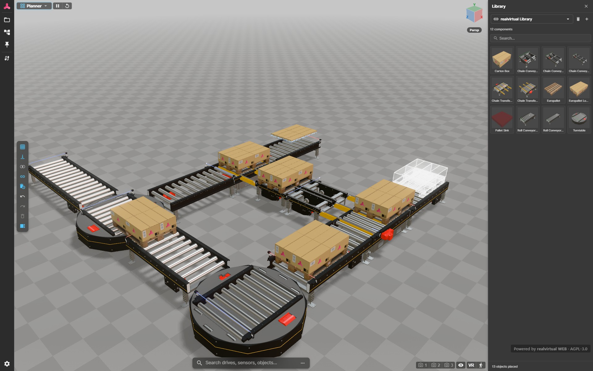

# Layout Planner & Library Objects — realvirtual WEB

This document describes the **Layout Planner** plugin and the **library
object** pipeline that feeds it: how library objects are authored in Unity,
how they are exported to GLB, how the Planner discovers and consumes them,
and how their pivot is computed.

The Layout Planner lets a browser user assemble industrial layouts (cells,
lines, halls) by dragging reusable library objects (conveyors, robots,
fixtures, scans) onto a grid, positioning them with translate / rotate
gizmos, and snapping them to each other or to the floor. The plugin lives
under [`src/plugins/layout-planner/`](src/plugins/layout-planner/).



**Live demo:** [web.realvirtual.io/demo (Planner)](https://web.realvirtual.io/demo/?scene=published%3ADemoPlanner&mode=planner)

---

## 1. Concepts at a glance

| Term | Meaning |
|---|---|
| **Library object** | A single-root GLB authored in Unity and treated as one reusable, repositionable unit in the browser. |
| **Library catalog** | A JSON document listing library entries (`LibraryCatalog` in [`rv-layout-store.ts`](src/plugins/layout-planner/rv-layout-store.ts)). |
| **Placed component** | An instance of a library entry placed in the current scene. Stored as `PlacedComponent` (id, catalogId, glbUrl, position, rotation, scale, visibility). |
| **Pivot** | The local origin of a library object. The gizmo, layout snap and rotation centre all use the pivot. |
| **WebPivot marker** | Optional Unity component that overrides the auto-pivot for a specific library object. |
| **Snap point** | Named empty Object3D inside a library object that acts as a typed connector to another asset. Authored in Unity as `Snap-<DIR>-<TYPEID>`. See §6. |
| **TypeId** | Compatibility key carried in a snap-point name. Two snaps may mate only if their typeIds match. |
| **Flow** | Direction semantics of a snap (`in` / `out` / `bidi`) encoded in the sign letter `N` / `P` / `B`. Controls which pairings are allowed. |
| **Pair / paired snap** | Bidirectional connection between two snaps, recorded as `pairedSnapId` on both ends. A paired snap is `occupied`. |
| **Chain** | The transitive closure of assets reachable through paired-snap edges. In chain mode, dragging one member rigidly moves the entire chain. |

A library object is just a GLB plus metadata. Nothing in the GLB format
itself distinguishes a "library object" from a "full scene" — what makes a
GLB a library object is how it is *authored* (single root, library-shaped
content) and how it is *consumed* (one entry in a catalog, instantiable many
times).

---

## 2. Authoring a library object in Unity

### 2.1 Single export

In the Unity Editor:

1. Select the GameObject that should become the library object root.
2. Open **Window → realvirtual → WebViewer**.
3. Click **Export as Library Object**.
4. Pick the destination filename — defaults to the GameObject's name with
   a `.glb` suffix, inside the WebViewer `public/models/` folder.

The export uses the multi-root constructor with a single transform, so the
exported scene has the GameObject itself as the top-level glTF node — no
`__root__` wrapper. The resulting GLB drops in cleanly as one entry in any
catalog.

### 2.2 Batch export

For building a whole library at once:

1. Select **multiple** GameObjects in the hierarchy.
2. Click **Export Selected as Library Objects (Batch)** in the same panel.
3. Choose a destination folder.
4. Each selected GameObject is written as its own single-root `.glb`
   named after the GameObject (sanitized).

Objects marked `IExcludeFromGLBExport` are skipped. Existing files in the
target folder are overwritten after a single aggregate confirmation. A
summary dialog at the end reports successes and failures and offers a
"Open Folder" button.

### 2.3 Optional pivot marker — `WebPivot`

By default the WebViewer computes the pivot of a library object from its
geometry (see §3). To override that with a hand-authored pivot, place an
empty child GameObject anywhere under the library root and add the
**Web Pivot** component
([`Packages/io.realvirtual.professional/Runtime/WebViewerHMI/WebPivot.cs`](../../Packages/io.realvirtual.professional/Runtime/WebViewerHMI/WebPivot.cs))
to it. The child's transform position is the pivot — move it with the
Scene-view gizmo to wherever the rotation / snap origin should sit
(typically the floor-center of the base, the centre of a mounting flange,
or the tool-flange of a robot).

The marker is a pure Unity-side metadata component (no runtime function).
It is serialized automatically by the GLB export plugin like any other
`Web*` component, so no extra wiring is needed.

**One marker per library object.** Multiple markers in the same subtree are
not supported — the first one found in depth-first order wins.

---

## 3. Pivot semantics

When a library object is loaded into the Planner the WebViewer recalculates
its pivot before it ever sits in the scene. Two paths, in order:

1. **WebPivot override.** If any descendant carries `WebPivot` in its
   `userData.realvirtual`, the marker's world position becomes the new
   origin — both XZ and Y come from the marker. Geometry is shifted by the
   inverse offset so the visual position of the model is unchanged but its
   local origin now coincides with the marker.

2. **Auto AABB bottom-center (fallback).** If no marker is found, the new
   origin is `(AABB.centre.x, AABB.min.y, AABB.centre.z)` — the centre of
   the model's full axis-aligned bounding box, projected down to the
   bounding box floor.

The implementation is `pivotToFloorCenter` in
[`src/plugins/layout-planner/model-cache.ts`](src/plugins/layout-planner/model-cache.ts).

### Why bottom-center and not contact-footprint?

The auto path uses the **full AABB centroid**, not a contact-footprint
centroid. Predictable and explicit: drop a library object onto the floor
and it lands centred on the cursor with its lowest point on the floor.
Asymmetric models (a robot with a long arm overhang, an L-shaped fixture)
get a pivot above the geometric centre of the AABB floor rectangle — which
may be over empty floor space. That is intentional. When you need the
pivot somewhere else (a robot base, a flange, a corner), use a `WebPivot`
marker.

---

## 4. Library catalogs

A catalog is a `LibraryCatalog` document (see
[`rv-layout-store.ts`](src/plugins/layout-planner/rv-layout-store.ts)) that
groups library entries into a single Planner tab. Each entry is a
`LibraryCatalogEntry` with at minimum an `id`, `name`, `category`, and
either a `glbUrl` (mesh asset) or a `splatUrl` (Gaussian splat).

Catalogs come from four sources:

| Source | How it's discovered |
|---|---|
| **Built-in catalogs** | Bundled with the WebViewer, listed in the Catalog tab. |
| **Local Folder** | The user picks a working folder via the File System Access API. The Planner scans `library/` for `.glb` and `splats/` for `.splat` / `.ksplat` / `.ply`. Subfolders become **collections** (filter chips); the first subfolder also maps to a **category** for `conveyor`, `robot`, `machine`, `fixture`, `des`. |
| **Remote URL** | A catalog JSON hosted at a URL added through the Catalog tab. |
| **GitHub repository** | A `github.com/<owner>/<repo>` URL (optionally `/tree/<branch>` or `/tree/<branch>/<subfolder>`). The Planner scans the repository tree via the public GitHub API for every `.glb` file, turns each into a `custom` entry whose `glbUrl` is the file's raw URL, and maps the immediate parent folder to a **collection** chip. No `catalog.json` is required. |

### 4.1 The standard library

A standard parts library ships with every build and loads automatically on
startup from the **bundled local assets** under
[`public/models/library/`](public/models/library/) — not from any remote source.
`loadBundledLibrary` reads `public/models/library/catalog.json` (generated by
`npm run build:library`, which scans the folder and derives each entry's
category and name from its sub-folder and filename); if the catalog is absent it
falls back to an `import.meta.glob` scan of the same folder. The library appears
as a catalog tab named *realvirtual Library*, and thumbnails are rendered at runtime.

Additional catalogs are **opt-in** — they are never loaded by default. Append a
catalog-JSON URL or a GitHub repository (see below) with the `?library=<url>` URL
parameter (repeatable), or add one at runtime through the Catalog tab.

The accepted GitHub repo-scan URL forms (`isGitHubRepoScanUrl` /
`buildCatalogFromGitHub` in
[`rv-layout-store.ts`](src/plugins/layout-planner/rv-layout-store.ts)):

- `https://github.com/<owner>/<repo>`
- `https://github.com/<owner>/<repo>/tree/<branch>`
- `https://github.com/<owner>/<repo>/tree/<branch>/<subfolder>`

A URL that points directly at a `.json` file or a `/blob/` path is treated as
a catalog manifest / single file, not a repository scan.

Thumbnails are auto-generated from the GLB if no `thumbnailUrl` is supplied
(see `thumbnail-renderer.ts`). For Local Folder catalogs, generated
thumbnails are persisted next to the source asset (`.png` with the same
relative path).

`pivotToFloor` on a catalog entry gates the §3 pivot recalculation per
entry. It defaults to `true` for GLB entries and `false` for Gaussian
splats (splats don't have a meaningful AABB-floor concept). The WebPivot
marker takes precedence regardless of this flag.

---

## 5. Drop, snap, gizmo

### Drop

When the user clicks an entry in the catalog the Planner instantiates the
GLB (cached by URL via `ModelCache`), runs the pivot recalculation, and
adds it to the scene at the cursor position projected onto the grid. The
placed object is registered with the viewer's node registry so other
plugins (Gaussian splats, multiuser sync, MCP) can address it by path.

### Snap

Three independent snap systems, in priority order when more than one is
enabled:

1. **Snap points** (component-level) — match named ports on each library
   object (e.g. conveyor input ↔ conveyor output). The dominant placement
   mechanism for assembled layouts. Documented in §6 below.
2. **Bbox snap** — magnetic snap to other layout objects' bounding-box
   edges/centres. See [`bbox-snap.ts`](src/plugins/layout-planner/bbox-snap.ts).
3. **Grid snap** — translation snaps to `gridSizeMm`; rotation snaps to
   `rotationSnapDeg`. Both are configurable from the Planner panel.

When a snap-point match engages during a drag, it overrides bbox and grid
snap for that frame. Bbox snap overrides grid snap.

### Drop-to-surface

When `dropToSurface` is enabled, every translation drops the moved object
onto the highest surface beneath it (raycast from the pivot's world XZ).
For multi-selection, the entire selection moves as one rigid group via the
centroid pivot built in
[`multi-select-pivot.ts`](src/plugins/layout-planner/multi-select-pivot.ts).

### Transform gizmo

A standard Three.js `TransformControls`-based gizmo, with `select` /
`translate` / `rotate` modes. The gizmo sits at the object's local origin
— which is exactly the pivot computed in §3. Choosing the right pivot at
authoring time means the gizmo is always where the user expects.

---

## 6. Snap points

Snap points are named empty Object3D nodes that act as **typed connectors**
between library objects. Where bbox snap is generic geometry magnetism,
snap points carry semantics: a conveyor's "roller output" only mates with a
"roller input" of the same type. The Planner reveals matching snaps as the
user drags, pulls the dragged asset magnetically into the matching pose,
and locks both ends into a paired connection so they move as one chain.

The implementation lives under [`src/plugins/snap-point/`](src/plugins/snap-point/).

### 6.1 Naming convention `Snap-<DIR>-<TYPEID>`

Snap points are authored in Unity as empty GameObjects whose **name** encodes
their role. The Planner discovers them at GLB-load time by parsing the name
— there is no separate metadata channel.

```
Snap-<AXIS><FLOW>-<TYPEID>

AXIS    = X | Y | Z          — cardinal axis the snap faces
FLOW    = N | P | B          — flow semantics encoded in the sign letter
            N = INPUT  (inbound port)
            P = OUTPUT (outbound port)
            B = BIDI   (either direction)
TYPEID  = arbitrary string; may contain hyphens
```

Examples:

| Name | Meaning |
|---|---|
| `Snap-ZN-convroll`   | Z-axis **input** for `convroll` (roller-conveyor input) |
| `Snap-ZP-convroll`   | Z-axis **output** for `convroll` (roller-conveyor output) |
| `Snap-ZB-convroll`   | Z-axis **bidirectional** `convroll` snap (e.g. turntable) |
| `Snap-XB-flange-1`   | X-axis bidi connector with `typeId = "flange-1"` |

Two name parts are independent:

- **AXIS** picks the *named* axis. The actual outward direction used by
  the alignment math is derived from the snap's **position** inside its
  owning asset, not from the sign letter — this makes snaps robust against
  Unity → glTF X-flip and asset rotation. See `snap-alignment.ts`.
- **FLOW** controls compatibility (see §6.2).

Parser: [`snap-name-parser.ts`](src/plugins/snap-point/snap-name-parser.ts).

### 6.2 Compatibility

Two snaps may engage iff:

1. Their **typeIds are identical** (case-sensitive string match).
2. Their **flows are compatible**:

    | A ↔ B | Compatible? |
    |---|---|
    | `in` ↔ `out`   | ✓ |
    | `in` ↔ `bidi`  | ✓ |
    | `out` ↔ `bidi` | ✓ |
    | `bidi` ↔ `bidi`| ✓ |
    | `in` ↔ `in`    | ✗ — two inputs would clash |
    | `out` ↔ `out`  | ✗ — two outputs would clash |

The axis letter is **not** a compatibility filter — outward direction
comes from snap position, so an `X` snap can mate with a `Z` snap when the
assets are rotated correctly.

A snap that is already occupied is excluded from candidate lookups. Snaps
on the same `ownerRoot` are never mated with each other.

### 6.3 Registry and discovery

At model load the snap-point plugin walks the loaded subtree, parses every
node name, and registers each match with `SnapPointRegistry`
([`rv-snap-point-registry.ts`](src/core/engine/rv-snap-point-registry.ts)).
The registry is the runtime source of truth for snap state:

- Indexed by `typeId` (compatibility lookup) and by `Object3D.uuid` (direct
  access).
- Indexed by `ownerRoot` for O(degree) per-asset lookups (chain walks).
- Tracks `occupied` and `occupiedBy` per snap so a paired snap cannot
  accept a second connection.

Each `SnapPoint` carries:

| Field | Meaning |
|---|---|
| `id`            | The Object3D `uuid` — collision-free, generated by Three.js |
| `object3D`      | The empty node in the GLB hierarchy |
| `dir`           | Parsed direction (`axis`, `sign`, `code`) |
| `typeId`        | Parsed typeId |
| `flow`          | `'in' \| 'out' \| 'bidi'` derived from the sign letter |
| `ownerRoot`     | Library asset root this snap lives under |
| `occupied`      | True iff something has been placed on this snap |
| `occupiedBy`    | Placed-component id of the connected asset |
| `pairedSnapId`  | Snap-id of the opposite half of the connection |

Snaps are wiped on `onModelCleared` and rescanned on every `onModelLoaded`.

### 6.4 Pairing and connection lifecycle

A connection is a **bidirectional, symmetric pair** between two snaps. The
registry maintains the pair through three operations:

| Operation | Effect |
|---|---|
| `pair(idA, idB)`              | Sets `pairedSnapId` on both ends; idempotent. |
| `markOccupied(id, placedId)`  | Sets `occupied = true` and `occupiedBy = placedId`. |
| `markFree(id)`                | Frees this snap **and its partner** symmetrically, clearing `occupied`, `occupiedBy`, `pairedSnapId` on both sides. |

Both ends are always managed in lock-step. Freeing one end never leaves
the partner in an "orphaned-occupied" state.

Connections are created in two places:

- **Picker placement.** When the user clicks an empty snap marker, picks a
  library entry from the popup, and confirms, `SnapPlacementService.place`
  inserts the asset snap-aligned to the target and pairs the two snaps.
- **Magnetic drag-snap.** See §6.5.

Connections are destroyed when:

- The owning asset is **deleted** from the scene (`unregisterUnder(root)`
  walks the subtree and frees every pair it touches).
- The user **ALT-drags** the asset (`_detachAssetConnections` severs every
  pair owned by that root before the drag arms).
- Chain mode is **disabled** at drag start (treated as solo-drag —
  same effect as ALT-drag).
- A drag **overstretches** an edge (the chain-break check in
  `applyChainFollow` frees the pair once the world distance between two
  paired snaps exceeds `CHAIN_BREAK_FACTOR × magnetRadius`; this only
  fires when external code moves a member out of step with the gizmo).

The `walkChain(start)` BFS returns the transitive closure of asset roots
reachable through paired-snap edges — the chain that follows a drag.

### 6.5 Magnetic drag-snap

`SnapMagneticController`
([`snap-magnetic-controller.ts`](src/plugins/snap-point/snap-magnetic-controller.ts))
turns drags into snap-aligned placements without an explicit click on a
snap marker.

**Lifecycle** (driven by `layout-drag-start / -tick / -end` viewer
events emitted by the layout planner):

| Phase | Action |
|---|---|
| `armForDrag(root, …)` | Cache the moving asset's snaps and the candidate set: every other registered, non-occupied snap that shares at least one typeId with the moving snaps. In chain mode the moving "pool" is expanded via `walkChain(root)` to every transitively connected asset; their world-relative offsets are captured for rigid follow-up. |
| `tick(root)`          | Each gizmo frame, find the moving/candidate pair with the smallest world-space distance below `radius` (default **400 mm**). If found, override the moving root's transform via `computeSnapAlignedWorldMatrix` so the pair lands snap-aligned. |
| `applyChainFollow()`  | After `tick`, set every chain member's world matrix to `movingRoot.matrixWorld × relMatrix` so its relative offset is preserved exactly. Then check for any edge that has stretched beyond `CHAIN_BREAK_FACTOR × radius` and free it. |
| `disarm(committed)`   | On drag-end, if a pair is engaged and `committed` is true, mark both ends `occupied` (cross-referenced) and call `pair(...)` to record the bidirectional link. |
| `cancel()`            | Drop arm state without committing (ESC, programmatic). |

**Modifiers and toggles**

- **Chain mode** (planner setting `chainModeEnabled`, default on) — paired
  assets follow as a rigid group. When off, each asset moves on its own
  and its existing connections are severed at arm time.
- **ALT-drag** — solo drag override regardless of chain mode. Triggers
  the same `_detachAssetConnections(root)` path as chain-off mode.
- **Snap-point magnet toggle** (planner setting `snapPointMagnetEnabled`,
  default on) — when off the controller never arms; drags use bbox/grid
  snap only.

**Visual feedback**

- `SnapChainPreview` glows every member that will move with the drag
  *before* the user has moved the cursor — hover an asset that
  participates in a chain and the whole chain lights up.
- `SnapMarkerRenderer` reveals matching empty markers as the cursor enters
  a candidate asset (proximity-based, with a short grace period so the
  user can move into the marker). The Planner toolbar's "Show All Snaps"
  toggle pins every idle marker visible regardless of hover.

### 6.6 Library-catalog integration

When the user clicks a vacant snap marker the picker popup needs to list
**every library entry that has at least one compatible snap**, not the
whole catalog. That lookup is served by
[`library-snap-index.ts`](src/plugins/snap-point/library-snap-index.ts):

- On first request for an entry, the GLB is loaded once via `GLTFLoader`,
  scanned for `Snap-*` node names, and the parsed snap list is cached.
- The cache lives in memory **and** in `localStorage` under
  `rv-snap-index-v1:<glbUrl>` so subsequent sessions skip the load.
- `findCompatibleLibraryAssets(entries, typeId, preferOppositeDirCode?, targetFlow?)`
  walks the catalog, filters entries by `typeId === target.typeId &&
  flowsCompatible(targetFlow, snap.flow)`, and returns
  `{ entry, ownSnapName }` pairs ready for the picker.
- `preferOppositeDirCode` is informational: when an asset exposes
  multiple matches it picks the one whose named axis matches the target's
  opposite (e.g. target `ZP` prefers candidate `ZN`). Outward alignment
  itself still runs off snap position, not the name.

The picker thus stays catalog-agnostic and works with **built-in**,
**local-folder**, and **remote-URL** catalogs (§4) without any extra
authoring step beyond the snap names in the GLB.

### 6.7 Validation rules

Before a placement commits, `SnapPlacementService.canPlace` enforces:

- The target snap must not be `occupied`.
- The asset must contain the named `ownSnap`.
- The `typeId` of `ownSnap` must equal the target's `typeId`.
- The flows must be compatible (in↔out, bidi↔anything).
- The asset must have **uniform scale** (epsilon 1e-4) — `Matrix4.decompose`
  misbehaves with non-uniform scale (Three.js issue #3845), and a
  non-uniform scale would skew the rigid alignment math.

Failures surface as `{ ok: false, reason: '…' }` for the picker to show
inline.

### 6.8 Persistence of paired connections

The registry itself is rebuilt from scratch on every model load — paired
state is recovered by walking the placed-component list (see §7) and
re-running the same `pair(...)` calls that the drag/picker flow uses. No
separate connection table is serialized; the placed components plus the
GLB snap names are sufficient to reconstruct the chain graph
deterministically.

### 6.9 Component orientation flip

A placed library component with **two compatible snaps** of the same
`typeId` (for example a belt with `Inlet` + `Outlet`, both
`typeId='belt'`) can be re-oriented 180° around its connection without
deleting and re-placing it. The component is unpaired on the currently
engaged snap, rotated so the OTHER compatible snap inherits the
connection, and re-paired through the partner.

There are two ways to trigger the flip — both call the same
`flipPlacedComponent` service in
[`src/plugins/snap-point/snap-flip-service.ts`](src/plugins/snap-point/snap-flip-service.ts):

1. **Context menu** — right-click on the placed component and choose
   **Flip orientation (180°)**. The entry only shows when the
   component is currently paired through one snap and a same-typeId
   sibling snap exists on the same asset.
2. **Click icon** — while hovering or selecting a flippable component,
   a circular-arrow sprite appears just above the asset. Clicking the
   sprite flips the orientation immediately. The icon disappears
   automatically when dragging the asset with the gizmo so it doesn't
   compete with the standard transform handles.

The flip is **reversible**: flipping the same component a second time
restores the original pose (to ±1e-4 tolerance). It is blocked while the
simulation is playing — drives may be moving the hierarchy mid-tick. The
new transform is persisted via the regular `'layout-transform-update'`
event, so the layout-planner op-log, store, and multiuser replication
all pick it up automatically.

The 3D icon overlay can be turned off via the visual-settings toggle
`Show snap-flip icons` (default on). The context-menu entry is always
available. Components with three or more compatible snaps (crossings,
junctions) are out of scope for this MVP — only the binary flip case is
handled.

---

## 6.10 Locked LayoutObjects

Every placed catalog item carries `userData.realvirtual.LayoutObject` with
a `Locked` boolean. When `Locked = true`:

- Edits on any sub-path under the LayoutObject root are rejected.
  `RvExtrasEditorPlugin.updateOverlayField` returns `false` and logs a
  warning instead of writing to the userData / op log. This guards nested
  Drive / Sensor / Signal properties so a locked asset can't drift from
  the catalog defaults.
- The LayoutObject row itself remains editable. The user can flip the
  `Locked` flag back to `false` directly in the inspector without first
  unwinding nested overrides.
- The Transform / Set-Position / Delete context-menu actions skip locked
  entries (they remain hidden or disabled if every selected item is
  locked).

Deleting a LayoutObject (single or multi-selection) also purges every
overlay entry whose path falls under the deleted subtree. Re-placing a
catalog item with the same root name therefore starts from the GLB
defaults — sub-overlays from the previous instance never leak across.

---

## 7. Persistence

Library catalogs and placed components are persisted in the unified Scene
model (see [`doc-persistence.md`](doc-persistence.md)). Specifically:

- `catalogUrls` — list of catalog source URLs the user has loaded.
- `placed` — list of `PlacedComponent` records.

Library catalogs (`catalogUrls`) and `gridSizeMm` are persisted in the unified
Scene model; `rotationSnapDeg`, `dropToSurface` and `gridEnabled` are stored in
browser localStorage.

GLB blobs themselves are cached separately by `ModelCache` in the browser
Cache API (`rv-planner-glbs`), keyed by URL.

---

## 8. Folder layout for a local library

The recommended on-disk layout for a Local-Folder catalog:

```
<working folder>/
├── library/
│   ├── conveyor/
│   │   ├── RollConveyor2m.glb
│   │   └── RollConveyor2m.png        # optional thumbnail
│   ├── robot/
│   │   └── ABB_IRB1200.glb
│   ├── fixture/
│   │   └── Pallet1200x800.glb
│   └── PalletHandling/               # → collection chip "PalletHandling"
│       └── PalletLift.glb
└── splats/
    └── Hall1/
        └── Scan.splat                # → category "splat", collection "Hall1"
```

The first level under `library/` is mapped to a category (`conveyor`,
`robot`, `machine`, `fixture`, `des`, otherwise `custom`). All parent
directories under the source root become collection chips in the Local-Folder
tab.

---

## 9. URL parameters & deep links

The viewer reads several query parameters at startup that are relevant to the
Layout Planner. They compose, so a published link can boot directly into a
specific authoring state.

| Parameter | Effect |
|---|---|
| `?mode=planner` | Boots a fresh empty scene and opens the Layout Planner in authoring mode. If an explicit `?scene=` or `?model=` is also given, that scene/model loads instead of the empty one and the Planner still opens on top. |
| `?scene=empty` | Boots a fresh empty scene (no base GLB). The Planner is wired but not auto-opened. |
| `?library=<url>` | Appends a catalog source on top of the standard library (§4). Repeatable: `?library=<a>&library=<b>`. Accepts catalog-JSON URLs and GitHub repo-scan URLs. |

A shareable "start planning" link is simply:

```
https://<your-deploy>/?mode=planner
```

The `?mode=planner` deep-link is handled in
[`main.ts`](src/main.ts) (scene routing) and opens the panel via
`LayoutPlannerPlugin.openPlanner()`.

---

## 10. See also

- [`doc-webviewer.md`](doc-webviewer.md) — overall architecture and the
  scene loading pipeline.
- [`doc-persistence.md`](doc-persistence.md) — how Planner state is stored
  in the Scene model.
- [`doc-extending-webviewer.md`](doc-extending-webviewer.md) — plugin
  system and how layout-planner integrates as a plugin.
- [`src/plugins/layout-planner/model-cache.ts`](src/plugins/layout-planner/model-cache.ts) —
  `ModelCache`, `unwrapGltfRoot`, `pivotToFloorCenter`, `alignToFloor`,
  `dropToSurface`.
- [`src/plugins/layout-planner/rv-layout-store.ts`](src/plugins/layout-planner/rv-layout-store.ts) —
  catalog/placement state, Local-Folder discovery, persistence wiring.
- [`src/plugins/snap-point/`](src/plugins/snap-point/) — snap-point plugin
  (name parser, registry, picker, marker renderer, magnetic controller,
  chain preview, placement service, library snap index).
- [`src/core/engine/rv-snap-point-registry.ts`](src/core/engine/rv-snap-point-registry.ts) —
  runtime registry, pairing, occupancy, chain walk.
- [`Packages/io.realvirtual.professional/Editor/WebViewer/WebViewerToolbar.cs`](../../Packages/io.realvirtual.professional/Editor/WebViewer/WebViewerToolbar.cs) —
  Unity-side export entry points.
- [`Packages/io.realvirtual.professional/Runtime/WebViewerHMI/WebPivot.cs`](../../Packages/io.realvirtual.professional/Runtime/WebViewerHMI/WebPivot.cs) —
  pivot marker component.
